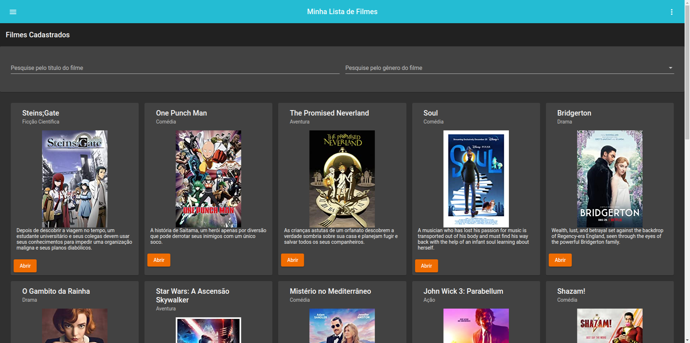

# DIO Ng Movies

<p align="center">
  

  
  
  <a href="https://github.com/vitorsemidio-dev/dio-ng-movies/commits/master">
    
  </a>
    
   
</p>



## Sobre o projeto

Projeto desenvolvido durante um dos cursos da [Digital Innovation One](https://digitalinnovation.one/). Aulas ministradas por [Renan Rafael](https://github.com/RenanRB)

O projeto consiste em um sistema de filmes, com a possibilidade de cadastros, edições, listagem e visualização dos cursos de outros usuários.

Repositório original: [RenanRB](https://github.com/RenanRB/curso-angular)

## 🔥 Como rodar o projeto?

Clone o repositório

```
$ git clone https://github.com/vitorsemidio-dev/dio-ng-movies
```

Instale as dependências

```
$ npm install
```

Inicie o servidor [json-server](https://github.com/typicode/json-server)

```
$ npm run json-server
```

Inicie o projeto Angular

```
$ npm run start
```

## Tecnologias usadas

- [Angular](https://angular.io/)
- [Angular Material](https://material.angular.io/)
- [Json Server](https://github.com/typicode/json-server)
- [Ngx Infinite Scroll](https://www.npmjs.com/package/ngx-infinite-scroll)
